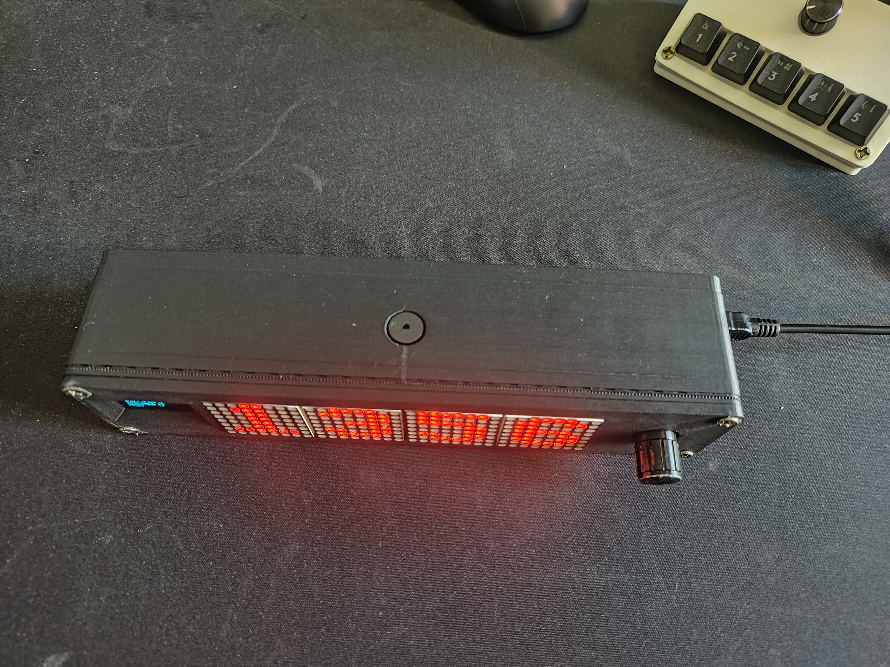
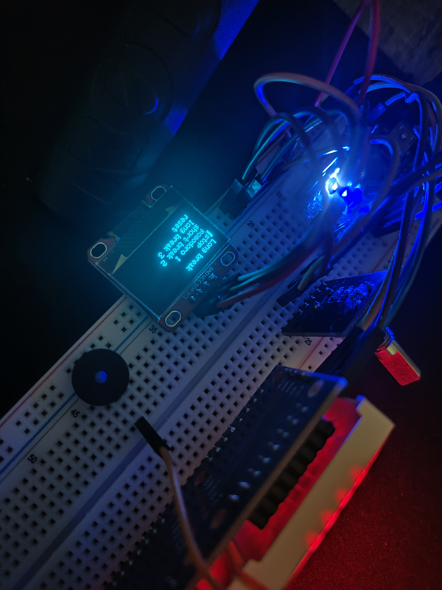
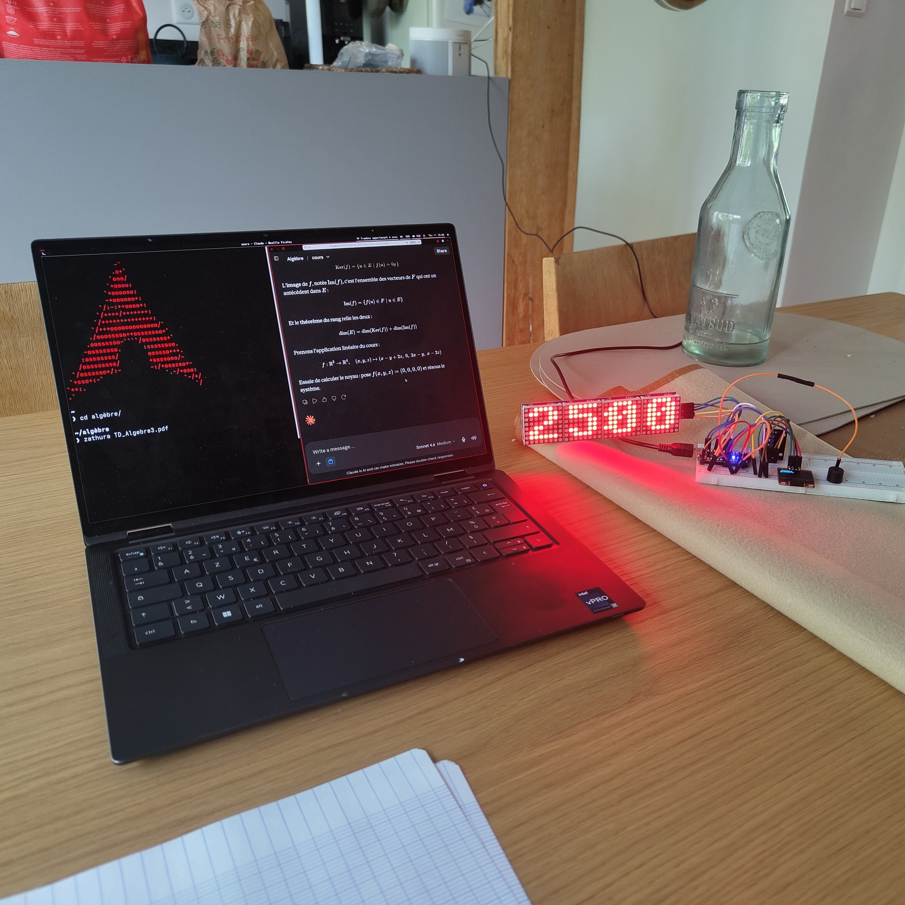
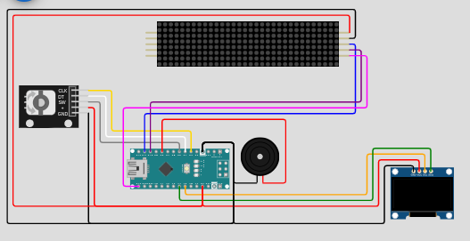

# 🍅 Arduino Pomodoro Timer

A physical Pomodoro timer built around an Arduino Nano, a 32×8 LED matrix, an OLED display, a rotary encoder, and a buzzer. Designed as a dedicated, distraction-free productivity device — no phone, no computer, just focused work.

The full Pomodoro cycle (work → short break → work → short break → long break) runs automatically, all durations are adjustable on the device itself, and the remaining time is displayed in large hand-drawn digits on the LED matrix. The electronics are housed in a custom 3D-printed enclosure.

> Prototyped and simulated with [Wokwi](https://wokwi.com) before hardware assembly. Built with [PlatformIO](https://platformio.org).

---

## Demo

| Finished device | Top view | OLED menu |
|:---:|:---:|:---:|
|  |  |  |

| In action (breadboard) | Wokwi simulation |
|:---:|:---:|
|  |  |

---

## Features

- **Full Pomodoro cycle** — automatically chains work sessions and breaks: `Pomodoro → short break → Pomodoro → short break → long break`, then repeats.
- **Adjustable durations** — set the length of each phase (Pomodoro / short break / long break) directly on the device with the rotary encoder.
- **Large countdown display** — minutes and seconds shown across the 32×8 LED matrix with a blinking colon, using hand-drawn 8×8 digit bitmaps.
- **OLED menu** — navigate options, start/stop the timer, and read the current phase on the 128×64 screen.
- **Adjustable brightness** — 16 intensity levels for the LED matrix.
- **Buzzer alert** — audio signal at the end of each phase.
- **Reset** — return to the start of a fresh Pomodoro cycle at any time.
- **Custom 3D-printed enclosure** — turns the breadboard prototype into a finished desk device.

---

## Hardware

| Component | Description |
|-----------|-------------|
| Arduino Nano | Microcontroller (ATmega328P) |
| LED Matrix 32×8 | 4× MAX7219-driven 8×8 modules, chained |
| OLED Display | 128×64 SSD1306, I²C |
| Rotary Encoder | KY-040 digital encoder with push button |
| Buzzer | Passive buzzer |
| Breadboard + jumper wires | Prototyping setup |
| 3D-printed enclosure | Custom case (see [`3d/`](3d/)) |

---

## Wiring

### LED Matrix — MAX7219 (`LedControl(DIN=11, CLK=13, CS=10, 4 devices)`)
| Arduino Nano | Matrix |
|---|---|
| D11 | DIN |
| D13 | CLK |
| D10 | CS |
| 5V | V+ |
| GND | GND |

### OLED Display — SSD1306 (I²C, address `0x3C`)
| Arduino Nano | OLED |
|---|---|
| A4 | SDA |
| A5 | SCL |
| 5V | VCC |
| GND | GND |

### Rotary Encoder — KY-040
| Arduino Nano | Encoder |
|---|---|
| D3 | CLK |
| D4 | DT |
| D5 | SW (push button) |
| 5V | VCC |
| GND | GND |

> `D3` is used as an interrupt pin (`attachInterrupt` on `CHANGE`) for reliable rotation detection.

### Buzzer
| Arduino Nano | Buzzer |
|---|---|
| D8 | + |
| GND | − |

---

## Enclosure

The electronics are housed in a custom enclosure modeled in **Fusion 360** and 3D-printed. The case makes the LED matrix, OLED and rotary encoder accessible on the front face, and routes the power cable cleanly out the side.

Design files are in the [`3d/`](3d/) folder:

| File | Description |
|------|-------------|
| `pomodoro.f3d` | Editable Fusion 360 source model |
| `pomodoro.3mf` | Print-ready mesh (slice and print directly) |

---

## Software

- **Language:** C++
- **Build system:** [PlatformIO](https://platformio.org)
- **Simulation:** [Wokwi](https://wokwi.com)

### Libraries

| Library | Purpose |
|---------|---------|
| `LedControl` | MAX7219 LED matrix driver |
| `Adafruit_SSD1306` | OLED display driver |
| `Adafruit_GFX` | Graphics primitives for the OLED |
| `Wire` | I²C communication (built-in) |

Declare them in `platformio.ini` under `lib_deps`.

---

## How It Works

1. On startup the OLED shows the menu: **play/stop**, **pomodoro**, **short break**, **long break**, **reset** (plus a second page for **brightness**).
2. Rotating the encoder moves the cursor through the menu; pressing the button selects an item.
3. Selecting a duration entry (e.g. *pomodoro*) opens a quick editor where you turn the encoder to set the minutes (0–99) and press to confirm.
4. Pressing **play** starts the countdown, rendered on the LED matrix with a blinking colon.
5. When a phase reaches `0`, the buzzer sounds and the firmware advances to the next phase in the cycle:

   ```
   Pomodoro ──▶ Short break ──▶ Pomodoro ──▶ Short break ──▶ Long break ──▶ (repeat)
   ```

6. **Reset** returns to a fresh Pomodoro at any time.

The countdown digits are drawn by writing custom 8×8 bitmaps (defined in the `digits[10][8]` array) to each of the four matrix modules — one module per digit — and the colon is toggled on a 1-second interval driven by `millis()`.

---

## Getting Started

### Prerequisites

- [PlatformIO](https://platformio.org) (recommended) or the Arduino IDE
- The libraries listed above

### Build & Upload (PlatformIO)

```bash
git clone https://github.com/michkaroma/pomodoro.git
cd pomodoro
pio run --target upload
```

### Simulate (Wokwi)

The repo includes `diagram.json` and `wokwi.toml`, so the project can be run directly in the [Wokwi VS Code extension](https://docs.wokwi.com/vscode/getting-started).

### Print the enclosure

Slice `3d/pomodoro.3mf` in your slicer of choice and print. Open `3d/pomodoro.f3d` in Fusion 360 if you want to tweak the dimensions.

---

## Project Structure

```
pomodoro/
├── 3d/
│   ├── pomodoro.3mf    # Print-ready mesh
│   └── pomodoro.f3d    # Fusion 360 source model
├── diagram.json        # Wokwi circuit definition
├── wokwi.toml          # Wokwi simulation config
├── platformio.ini      # PlatformIO project config
├── include/
├── lib/
├── src/
│   └── main.cpp        # Main firmware
└── test/
```

---

## Possible Improvements

- Persist custom durations to **EEPROM** so they survive a power cycle (scaffolding is present in the source).
- End-of-phase **melodies** instead of simple beeps (commented-out note tables included).

---

## Context

Personal project built during studies at **ECE Paris** — and put to use revising for end-of-term exams.
Goal: practice embedded C++ programming, I²C/SPI bus management, interrupt-driven inputs, hardware prototyping, and 3D enclosure design.